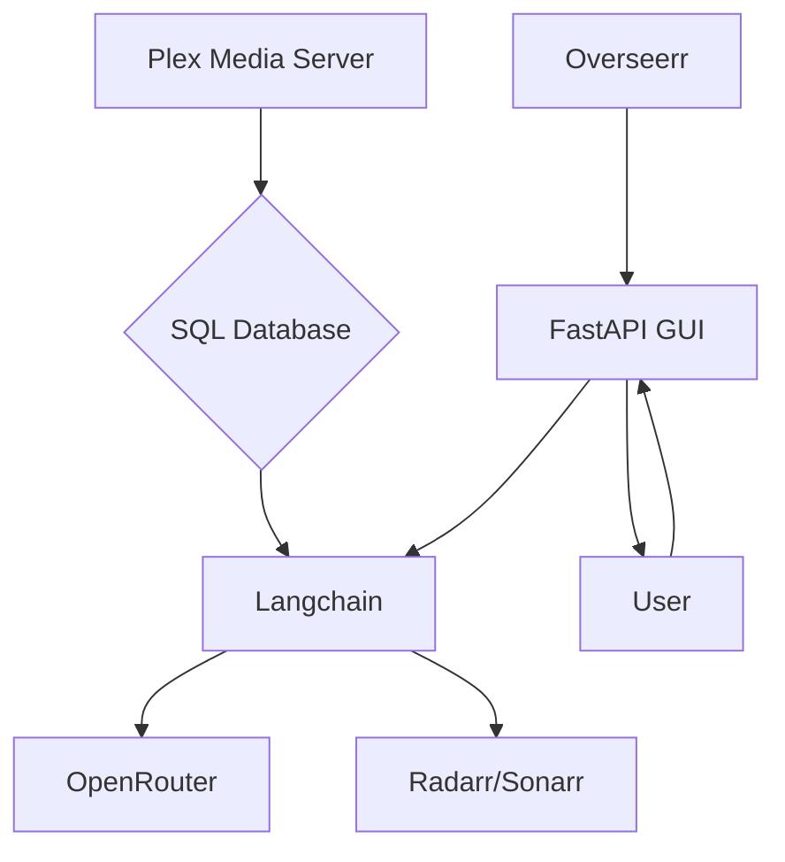
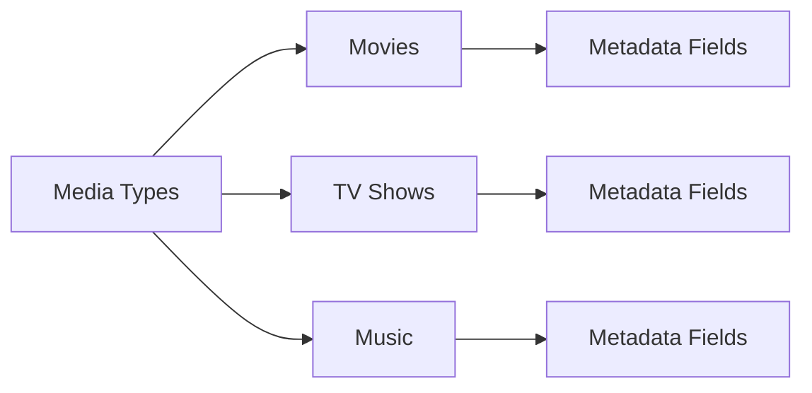
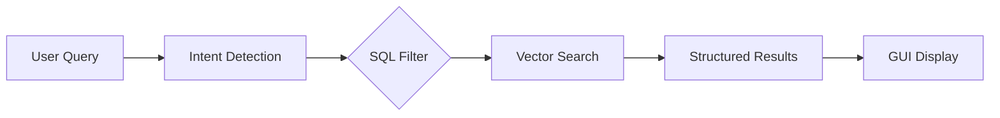
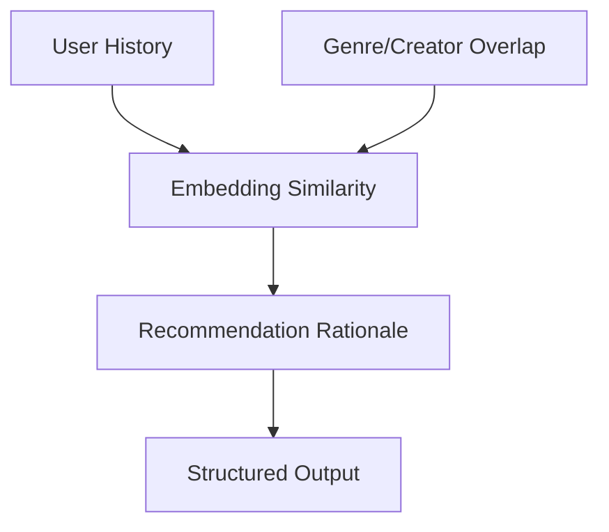
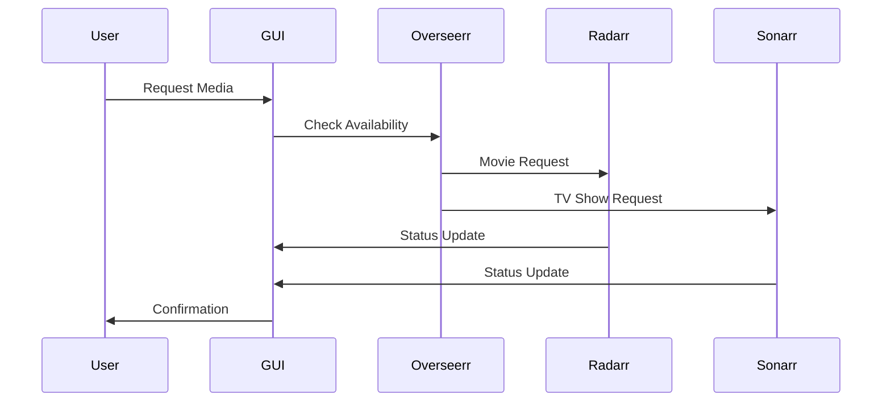
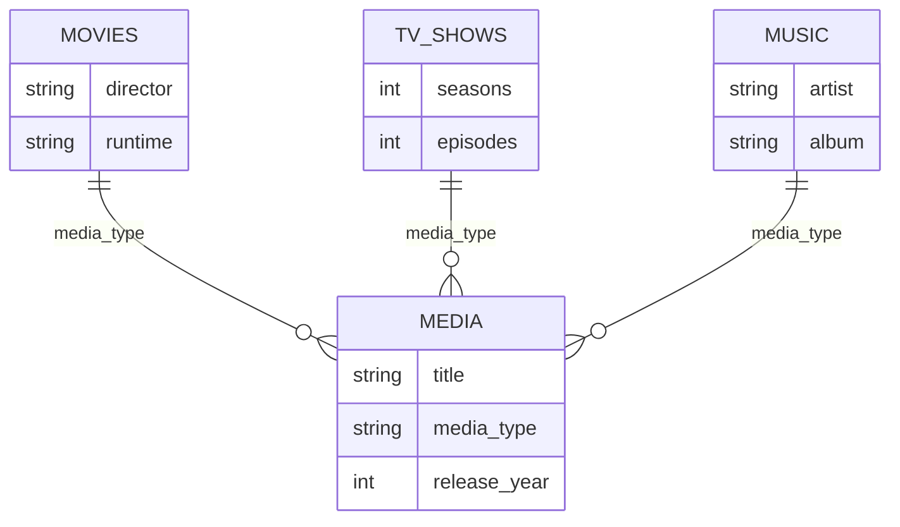

# AutoPlex Media LLM System

## Overview
Integrated media management system combining Plex, Overseerr, Sonarr, Radarr, FastAPI, Langchain, SQL, and OpenRouter for intelligent media discovery and management.

## Architecture


## Key Features
- Natural language media queries
- AI-powered recommendations with rationale
- Automated download requests
- Multi-media support (movies, TV shows, music)
- Material Design 3 compliant GUI

## Media Types & Metadata


## Query Processing


## Recommendation Engine


## Download Workflow


## Database Schema


## Safety & Security
- Input sanitization at all entry points
- NSFW content filtering (explicit/implicit)
- Data validation before API calls
- "I don't know" fallback for uncertain data

## Installation
```bash
# Clone repository
git clone https://github.com/yourusername/autoplex.git
cd autoplex

# Install dependencies
pip install -r requirements.txt

# Configure environment variables
cp .env.example .env
# Edit .env with your Plex, Overseerr, Radarr/Sonarr API keys and database credentials

# Initialize database
python init_db.py

# Start the application
uvicorn main:app --reload
```

## Usage Examples
- "Find 80s sci-fi movies under 2 hours"
- "Show all unwatched TV shows"
- "What songs by Daft Punk do I have?"
