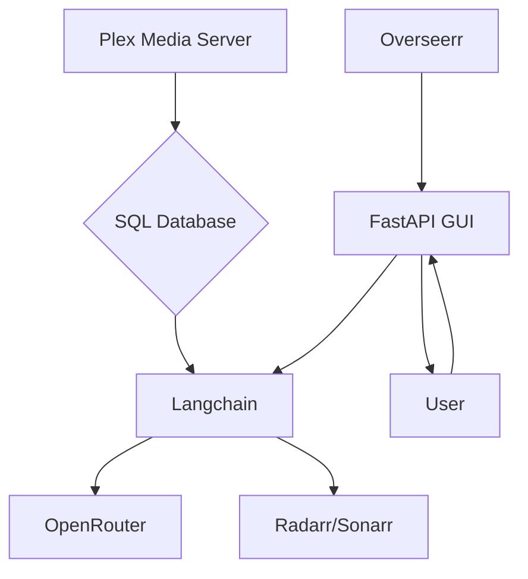
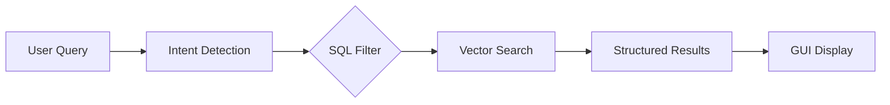
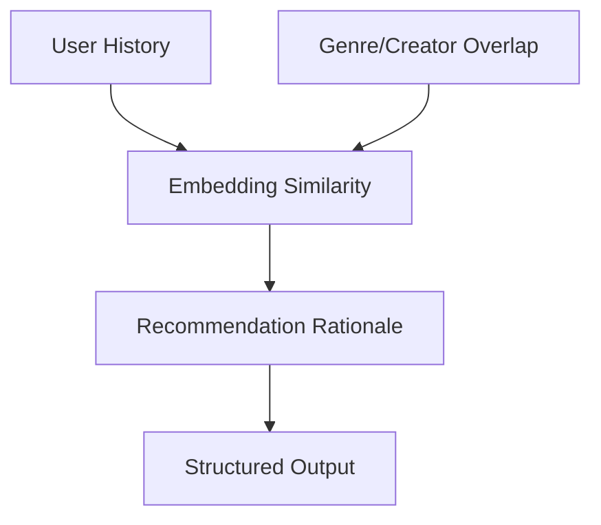
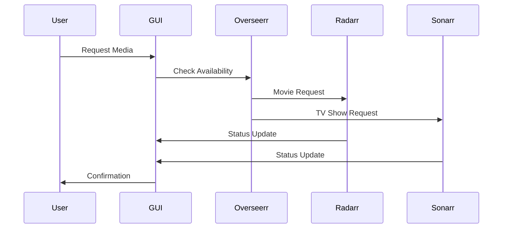
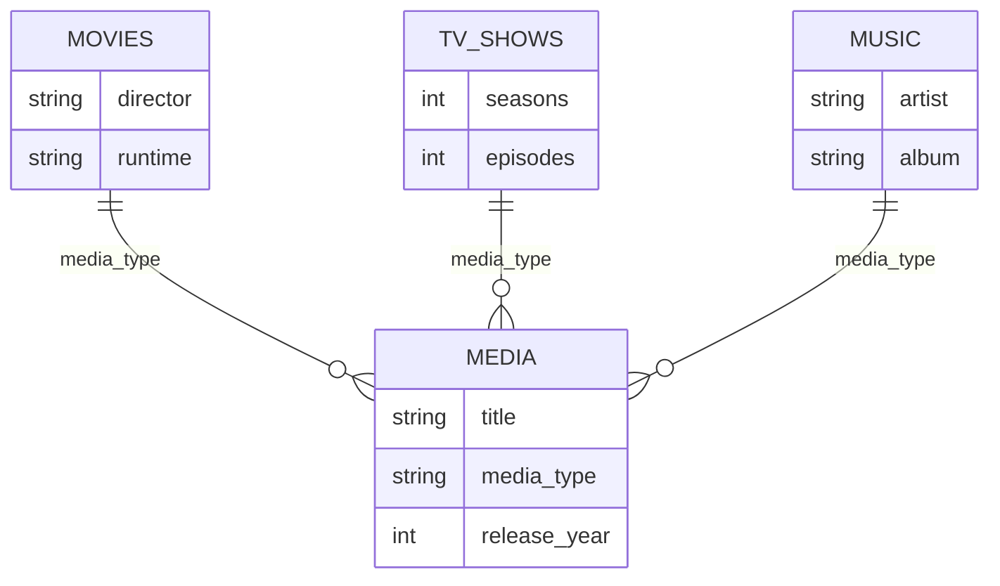

# AutoPlex Architecture

## Overview
AutoPlex is a media management system that integrates multiple services to provide intelligent media discovery and management. The architecture is designed to be modular, scalable, and extensible.

## Core Components

## Component Details

### Plex Media Server
- Primary media storage and playback system
- Provides metadata about all media in the library
- Supports movies, TV shows, and music

### SQL Database
- Centralized storage for all media metadata
- Full-text indexes for descriptions and tags
- Indexed fields include: title, media_type, genres, release_year, cast, director, artist

### Overseerr
- Manages media download requests
- Routes movie requests to Radarr and TV show requests to Sonarr
- Tracks request status and availability

### FastAPI GUI
- Web interface for user interaction
- Accepts natural language queries
- Displays structured metadata and recommendations
- Provides [Play], [Request], and [More Info] buttons

### Langchain
- Processes natural language queries
- Maps queries to SQL filters or vector searches
- Generates recommendations with rationale

### OpenRouter
- Provides access to LLMs for natural language processing
- Handles complex query intent detection
- Supports embedding similarity for recommendations

### Radarr/Sonarr
- Automates movie and TV show downloads
- Integrates with Overseerr for request management
- Tracks download status and metadata

## Data Flow

### Query Processing

### Recommendation Engine

### Download Workflow

## Database Schema

## Media Types and Metadata

### Movies
- Title, original title
- Summary, tagline, genres, keywords, collections
- Release year, release date
- Runtime, aspect ratio
- Studio, production companies
- Directors, writers, producers
- Cast (actor, character), voice actors
- Content rating, audio/subtitle languages
- File path, file size, format, codec, resolution
- Ratings (IMDb, TMDb, Rotten Tomatoes), Plex rating
- User rating, watch count, last played
- External IDs (IMDb, TMDb), added date, updated date

### TV Shows
- Title, original title
- Summary, tagline, genres, keywords
- First air date, last air date
- Seasons count, episodes count
- Status, runtime per episode
- Networks, production companies
- Creators, showrunners, producers
- Cast, guest stars
- Ratings (IMDb, TMDb, Plex), user rating
- Content rating, audio/subtitle languages
- File path, total file size

#### Seasons
- Season number, episode count
- Aired year, summary

#### Episodes
- Episode number, title, air date
- Summary, guest stars
- Directors, writers
- Runtime, watch count, last played
- File path, resolution, user rating

### Music
- Title, album, artist, album artist
- Track number, disc number
- Genres, tags, lyrics
- Release year, release date, duration seconds
- Composers, producers, featured artists
- Audio codec, bitrate, sample rate, channels
- File path, file size
- Play count, last played
- User rating, album art URL

## Integration Details

### Overseerr Integration
- Confirm title, year, media_type
- Check if request already exists
- Send to Overseerr API
- Route:
  - Movies → Radarr
  - TV Shows → Sonarr

### Radarr Integration
- GET /api/v3/movie/{tmdbId} to check existence
- POST /api/v3/movie to create a new movie entry
- POST /api/v3/command with "type": "MoviesSearch" to begin search/download

### Sonarr Integration
- POST /api/v3/series to create a monitored show
- POST /api/v3/episode to control specific episodes
- GET /api/v3/series/{id} for status and metadata
- POST /api/v3/command with "type": "SeriesSearch" to initiate search

## Safety and Security
- Input sanitization at all entry points
- NSFW content filtering (explicit/implicit)
- Data validation before API calls
- "I don't know" fallback for uncertain data
